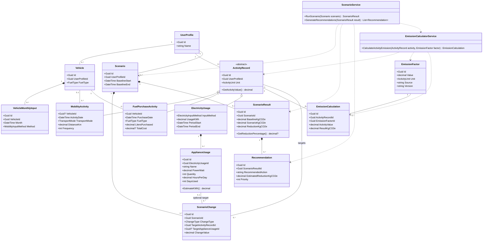
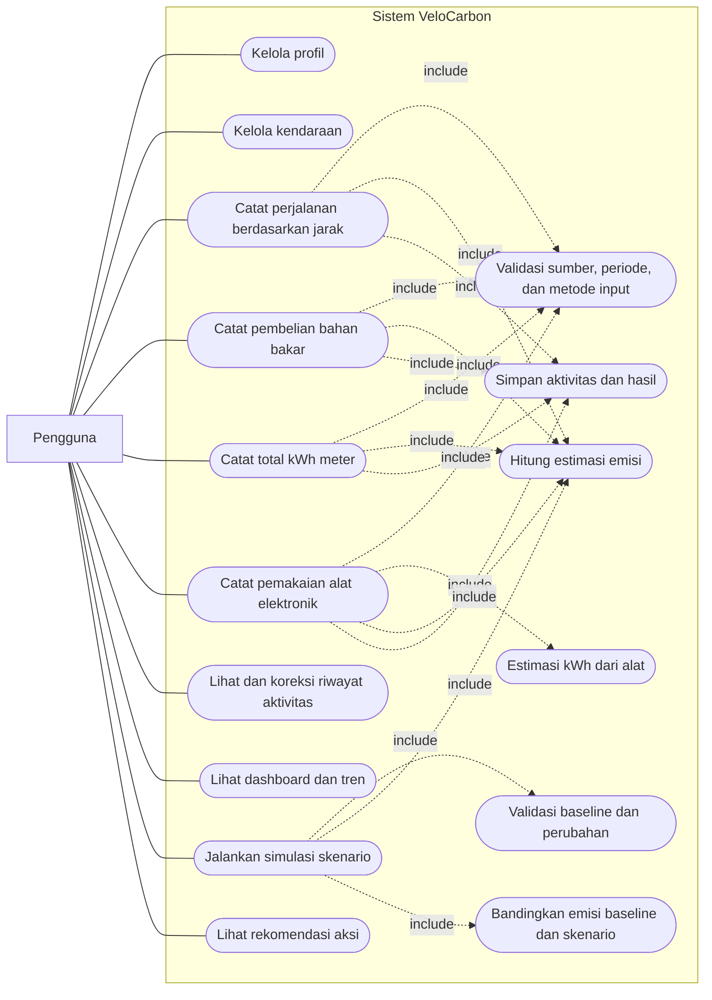
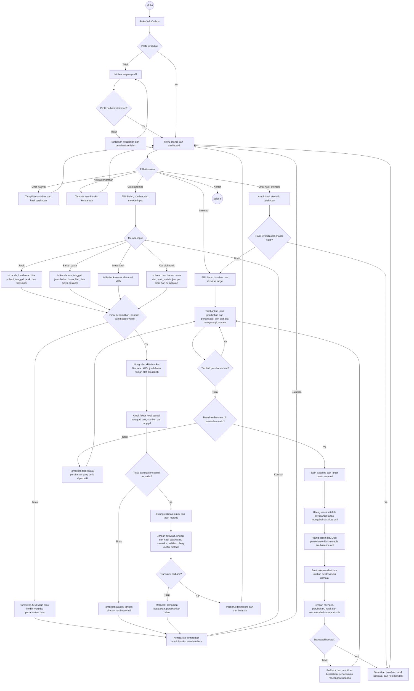

# Product Requirements Document — VeloCarbon

| Informasi | Nilai |
| --- | --- |
| Produk | VeloCarbon |
| Versi dokumen | 0.3 |
| Tanggal | 7 September 2026 |
| Status | Scope empat metode input disepakati; rancangan teknis untuk review tim |
| Pemilik dokumen | Faaid Sakhaa — Software Architect |
| Platform | C# .NET 8 WPF, Windows desktop |

## 1. Ringkasan Produk

VeloCarbon membantu individu mengubah data aktivitas sehari-hari menjadi estimasi jejak karbon yang dapat dipahami dan ditindaklanjuti. Produk berfokus pada dua sumber emisi yang mudah dicatat: perjalanan darat dan konsumsi listrik pribadi/kos. Pengguna dapat melihat emisi historis, mengetahui sumber terbesar, serta membandingkan dampak beberapa perubahan kebiasaan.

Keberhasilan produk ditentukan oleh tiga hal: perhitungan dapat ditelusuri ke faktor emisi yang digunakan, simulasi menghasilkan perbandingan yang jelas, dan aplikasi dapat berjalan lokal saat demonstrasi.

MVP mencakup empat metode input: perjalanan berdasarkan jarak, pembelian bahan bakar dalam liter, listrik berdasarkan total kWh, dan estimasi listrik berdasarkan alat elektronik. Input bahan bakar serta alat elektronik merupakan fitur wajib MVP. Metode alternatif tidak dijumlahkan untuk sumber dan periode yang sama.

## 2. Masalah, Pengguna, dan Tujuan

### Masalah

Pengguna tidak memiliki cara praktis untuk menyatukan data perjalanan dan listrik, memahami sumber emisi dominan, lalu mengukur dampak perubahan kebiasaan sebelum menerapkannya.

### Pengguna utama

Mahasiswa atau individu penghuni kos yang menggunakan kendaraan pribadi/transportasi darat dan membayar atau mengestimasi konsumsi listrik sendiri.

### Tujuan produk

1. Menghasilkan estimasi emisi CO2e per aktivitas dan periode.
2. Menunjukkan tren dan sumber emisi terbesar secara visual.
3. Membandingkan kondisi dasar dengan skenario pengurangan emisi.
4. Menyimpan data dan hasil perhitungan secara konsisten di PostgreSQL.

### Di luar ruang lingkup MVP

- Perhitungan emisi industri atau organisasi.
- Pelacakan lokasi otomatis/GPS.
- Pembelian kredit karbon, perdagangan karbon, atau klaim net-zero.
- Perhitungan emisi makanan, penerbangan, dan limbah.
- Akun daring dan sinkronisasi lintas perangkat.

## 3. Kebutuhan Fungsional

| ID | Kebutuhan | Kriteria penerimaan |
| --- | --- | --- |
| FR-01 | Pengguna dapat membuat dan memperbarui profil. | Profil memiliki nama tampilan dan preferensi satuan; perubahan tersimpan. |
| FR-02 | Pengguna dapat mengelola kendaraan. | Pengguna dapat menambah, mengubah, dan menghapus kendaraan beserta jenis bahan bakar/moda. |
| FR-03 | Pengguna dapat mencatat aktivitas perjalanan. | Rekaman minimal memuat tanggal, moda/kendaraan, jarak, dan frekuensi/jumlah perjalanan. |
| FR-04 | Pengguna dapat mencatat konsumsi listrik dari meter. | Rekaman memuat bulan kalender dan total kWh; alternatif estimasi alat mengikuti FR-12. |
| FR-05 | Sistem menghitung emisi berdasarkan faktor emisi aktif. | Hasil menyimpan nilai aktivitas, faktor, satuan, sumber faktor, dan emisi CO2e. |
| FR-06 | Pengguna dapat melihat ringkasan dan tren. | Dashboard menampilkan total periode, kontribusi per kategori, dan grafik bulanan. |
| FR-07 | Pengguna dapat membuat skenario. | Skenario mendukung perubahan jarak/frekuensi perjalanan atau persentase konsumsi listrik. |
| FR-08 | Sistem membandingkan skenario dengan kondisi dasar. | Hasil memuat emisi dasar, emisi skenario, pengurangan kgCO2e, dan persen. |
| FR-09 | Sistem menyajikan rekomendasi. | Rekomendasi menaut pada sumber emisi dominan dan menyebut estimasi dampaknya. |
| FR-10 | Sistem menyediakan faktor emisi lokal yang dapat diperbarui. | Faktor memiliki kategori, nilai, satuan, sumber, versi, tanggal berlaku, dan status aktif. |
| FR-11 | Pengguna mencatat pembelian bahan bakar. | Kendaraan, tanggal, jenis bahan bakar, dan liter wajib diisi; biaya opsional. Hasil diberi label estimasi berbasis pembelian. Nominal rupiah saja tidak digunakan untuk menghitung emisi. |
| FR-12 | Pengguna mengestimasi listrik dari alat elektronik. | Satu periode memuat minimal satu rincian nama alat, watt, jumlah perangkat, jam per hari, dan hari pemakaian. Aplikasi menampilkan kWh setiap rincian dan totalnya. |
| FR-13 | Sistem mencegah penghitungan ganda antar-metode. | Metode mobilitas dipilih per kendaraan per bulan; listrik memakai satu metode pada satu profil per bulan. Penyimpanan metode yang bertentangan ditolak dengan petunjuk koreksi, tanpa menghapus data otomatis. |
| FR-14 | Skenario mendukung semua metode input MVP. | Mendukung pengurangan jarak/frekuensi, liter pembelian, total kWh, atau jam pemakaian alat; perhitungan dilakukan pada salinan baseline tanpa mengubah catatan asli. |

## 4. Kebutuhan Nonfungsional

| ID | Kebutuhan |
| --- | --- |
| NFR-01 | Aplikasi berjalan pada Windows dengan .NET 8 dan PostgreSQL lokal yang didokumentasikan. |
| NFR-02 | Perhitungan inti dapat berjalan tanpa koneksi internet. |
| NFR-03 | Masukan numerik ditolak bila kosong, negatif, atau tidak sesuai satuan. |
| NFR-04 | Kesalahan basis data atau proses perhitungan ditampilkan dalam pesan yang jelas tanpa membuat aplikasi berhenti mendadak. |
| NFR-05 | Pengujian unit mencakup rumus emisi dan mesin skenario. |
| NFR-06 | Semua hasil memiliki satuan dan pembulatan yang konsisten. |

## 5. Aturan Bisnis dan Rumus

### Emisi aktivitas

```text
emisiKgCO2e = nilaiAktivitas x faktorEmisi
```

- Mobilitas menggunakan kilometer perjalanan atau liter bahan bakar, sesuai faktor yang dipilih.
- Listrik menggunakan kWh.
- Faktor emisi harus memiliki satuan yang kompatibel dengan nilai aktivitas.

### Empat metode input dan perhitungan

| Metode | Nilai aktivitas yang dihitung | Satuan faktor |
| --- | --- | --- |
| Jarak perjalanan | DistanceKm × Frequency; jarak per perjalanan satu arah, frekuensi jumlah perjalanan pada tanggal tersebut | kgCO2e/km, sesuai moda dan asumsi okupansi sumber faktor |
| Pembelian bahan bakar | LitersPurchased | kgCO2e/liter, sesuai FuelType |
| Total listrik | UsageKWh | kgCO2e/kWh |
| Estimasi alat elektronik | Jumlah seluruh (PowerWatt / 1000 × Quantity × HoursPerDay × DaysUsed) | kgCO2e/kWh |

- Pembelian bahan bakar diakui pada tanggal pembelian. Ini pendekatan estimasi, bukan pengukuran bahan bakar yang terbakar; sisa tangki tidak dimodelkan pada MVP.
- Estimasi alat mengasumsikan daya rata-rata tetap selama jam yang dimasukkan. Daya nameplate, siklus AC/kulkas, dan standby dapat membuat hasil berbeda dari meter. Tampilkan label estimasi dan asumsi tersebut.
- Liter, jarak, watt, dan jumlah perangkat harus positif; frekuensi/jumlah perangkat/hari berupa bilangan bulat. Jam per hari berada dalam (0, 24], hari pemakaian tidak melebihi panjang periode. Nol kWh meter diperbolehkan untuk periode tanpa konsumsi.
- Nilai faktor tidak boleh negatif. Faktor harus cocok kategori, satuan, jenis bahan bakar/moda, dan tanggal; faktor tidak ditemukan atau ambigu menghasilkan pesan kesalahan, bukan nilai default nol.
- Faktor untuk periode listrik dipilih berdasarkan tanggal awal periode; aturan ini ditampilkan pada rincian perhitungan. Faktor yang pernah dipakai tidak ditimpa: perubahan membuat versi baru agar hasil dapat ditelusuri.
- Nilai internal menggunakan decimal; pembulatan dua angka desimal hanya saat ditampilkan, bukan pada setiap rincian sebelum penjumlahan.

### Batas periode dan pencegahan penghitungan ganda

Untuk MVP, laporan dan baseline skenario menggunakan satu bulan kalender penuh. Setiap profil mewakili satu cakupan konsumsi listrik pribadi/kos. Periode listrik dimulai pada hari pertama dan berakhir pada hari terakhir bulan; periode lintas bulan ditolak agar tidak membutuhkan alokasi harian yang belum dimodelkan.

1. Kendaraan pribadi memiliki satu pilihan metode pada setiap bulan: Distance atau FuelPurchase. Beberapa catatan metode yang sama boleh ditambahkan, tetapi metode alternatif untuk kendaraan/bulan tersebut ditolak. Bulan berikutnya boleh menggunakan metode berbeda.
2. Perjalanan kendaraan pribadi wajib memilih VehicleId agar aturan tersebut dapat diperiksa. VehicleId boleh kosong hanya untuk moda nonkendaraan pribadi, misalnya berjalan kaki, bus, atau kereta. FuelPurchaseActivity selalu memerlukan kendaraan berbahan bakar cair yang sesuai.
3. Listrik hanya memiliki satu ElectricityUsage per profil per bulan: MeterKWh atau ApplianceEstimate. Pada metode meter, rincian alat harus kosong; pada metode alat, total berasal dari rincian dan tidak dapat diisi manual.
4. Pergantian metode dilakukan melalui koreksi catatan sumber pada bulan itu; aplikasi meminta konfirmasi sebelum mengganti/menghapus data, dan tidak menjumlahkan hasil lama serta baru. Validasi dijalankan di service dan transaksi basis data, bukan hanya UI.
5. Aktivitas dan hasil emisinya disimpan secara atomik. Penghitungan ulang memperbarui satu hasil aktivitas; dashboard tidak menjumlahkan beberapa versi hasil untuk aktivitas yang sama.

### Skenario

```text
emisiSkenario = total emisi aktivitas setelah perubahan skenario
penguranganKgCO2e = emisiDasar - emisiSkenario
penguranganPersen = (penguranganKgCO2e / emisiDasar) x 100
```

Jika emisi dasar nol, persentase pengurangan ditampilkan sebagai tidak tersedia untuk menghindari pembagian dengan nol.

Skenario menggunakan satu bulan baseline yang dipilih. Setiap ScenarioChange menargetkan satu ActivityRecord; perubahan jam alat juga menunjuk satu ApplianceUsage dalam aktivitas tersebut. Jenis perubahan: ReduceDistancePercent, ReduceFrequencyPercent, ReduceFuelPercent, ReduceElectricityPercent, atau ReduceApplianceHoursPercent, dengan nilai 0–100. Maksimal satu perubahan per aktivitas kecuali pengurangan jam pada alat berbeda; pengurangan total listrik tidak boleh digabung dengan pengurangan alat dalam aktivitas yang sama. Frekuensi skenario boleh menjadi nilai ekspektasi pecahan, tanpa mengubah frekuensi integer pada catatan asli.

Simulasi tidak mengonversi liter menjadi kilometer dan tidak memperkirakan perpindahan moda dari catatan pembelian. Perpindahan moda otomatis ditunda; pengguna dapat membandingkan pengurangan penggunaan pada sumber yang dicatat. Pengurangan tahunan bukan hasil aktual MVP. Rekomendasi menyebut estimasi pengurangan pada bulan baseline, tidak dijumlahkan antar-alternatif, dan Priority diurutkan berdasarkan dampak menurun (1 tertinggi).

## 6. Arsitektur MVP

```text
Presentation (WPF Views)
        <-> Presentation Logic (ViewModels)
        <-> Application Layer (Services / Use Cases)
        <-> Domain Layer (Models, Rules, Scenario Engine)
        <-> Infrastructure (EF Core Repositories, PostgreSQL)
```

| Lapisan | Tanggung jawab |
| --- | --- |
| Views | Mengikat data dan menerima interaksi pengguna; tidak memuat rumus bisnis. |
| ViewModels | Mengelola state tampilan, perintah, dan validasi ringan. |
| Services | Menjalankan use case pencatatan, perhitungan, dashboard, dan simulasi. |
| Domain | Menyimpan aturan bisnis dan model PBO yang tidak bergantung pada WPF/EF Core. |
| Infrastructure | Mengakses PostgreSQL melalui EF Core dan mengisolasi detail penyimpanan dari lapisan lain. |

### Batas modul

- `EmissionCalculatorService` tidak mengetahui View atau database; ia menerima aktivitas dan faktor melalui antarmuka.
- `ScenarioService` menghasilkan hasil simulasi dan rekomendasi yang dapat diuji menggunakan data tiruan.
- `EmissionFactorRepository` menjadi jalur akses faktor emisi dari basis data.
- Perhitungan inti tidak bergantung pada layanan eksternal sehingga aplikasi tetap dapat digunakan saat demonstrasi lokal.

## 7. Model Domain dan Basis Data

| Entitas | Atribut inti | Relasi utama |
| --- | --- | --- |
| UserProfile | Id, Name, UnitPreference, CreatedAt | Memiliki kendaraan, aktivitas, dan skenario. |
| Vehicle | Id, UserProfileId, Name, VehicleType, FuelType | Dimiliki satu profil dan dapat digunakan oleh aktivitas mobilitas. |
| ActivityRecord | Id, UserProfileId, Unit | Kelas abstrak untuk aktivitas mobilitas dan penggunaan listrik. |
| MobilityActivity | VehicleId?, ActivityDate, TransportMode, DistanceKm, Frequency | Turunan ActivityRecord; kendaraan bersifat opsional. |
| FuelPurchaseActivity | VehicleId, PurchaseDate, FuelType, LitersPurchased, TotalCost? | Turunan ActivityRecord; satu kendaraan wajib. |
| VehicleMonthlyInput | Id, VehicleId, Month, Method | Satu pilihan Distance/FuelPurchase per kendaraan per bulan; Month adalah tanggal pertama bulan. |
| ElectricityUsage | InputMethod, UsageKWh, PeriodStart, PeriodEnd | Turunan ActivityRecord; MeterKWh atau ApplianceEstimate. UsageKWh diisi pada metode meter, dihitung dari rincian pada metode alat. |
| ApplianceUsage | Id, ElectricityUsageId, Name, PowerWatt, Quantity, HoursPerDay, DaysUsed | Rincian estimasi alat yang hanya dimiliki satu ElectricityUsage. |
| EmissionFactor | Id, Category, Subcategory, Value, Unit, Source, Version, ValidFrom, ValidUntil?, IsActive | Dipakai oleh perhitungan dan dapat digunakan berkali-kali. |
| EmissionCalculation | Id, ActivityRecordId, EmissionFactorId, ActivityValue, ResultKgCO2e, CalculatedAt | Menyimpan jejak audit satu perhitungan aktivitas. |
| Scenario | Id, UserProfileId, Name, BaselineStart, BaselineEnd, CreatedAt | Memiliki satu atau lebih perubahan dan maksimal satu hasil aktif. |
| ScenarioChange | Id, ScenarioId, ChangeType, TargetActivityRecordId, TargetApplianceUsageId?, ChangeValue | TargetCategory diturunkan dari aktivitas; target alat wajib hanya untuk perubahan jam alat. |
| ScenarioResult | Id, ScenarioId, BaselineKgCO2e, ScenarioKgCO2e, ReductionKgCO2e, CalculatedAt | Menyimpan hasil; persentase pengurangan dihitung dari nilai dasar. |
| Recommendation | Id, ScenarioResultId, Title, Description, TargetCategory, RecommendedAction, EstimatedReductionKgCO2e, Priority, CreatedAt | Dihasilkan dari hasil skenario dan diurutkan berdasarkan prioritas. |

### Relasi dan aturan model

- Satu `UserProfile` memiliki nol atau banyak `Vehicle`, `ActivityRecord`, dan `Scenario`.
- `ActivityRecord` adalah kelas abstrak yang diturunkan menjadi `MobilityActivity`, `FuelPurchaseActivity`, dan `ElectricityUsage`.
- Satu `Vehicle` dapat digunakan oleh banyak `MobilityActivity`; kendaraan bersifat opsional pada aktivitas nonkendaraan pribadi.
- Satu `ActivityRecord` memiliki maksimal satu `EmissionCalculation`, sedangkan satu `EmissionFactor` dapat digunakan oleh banyak perhitungan.
- Satu `Scenario` terdiri atas satu atau lebih `ScenarioChange` dan memiliki maksimal satu `ScenarioResult` aktif.
- Satu `ScenarioResult` dapat menghasilkan nol atau banyak `Recommendation`.
- `ScenarioChange`, `ScenarioResult`, dan `Recommendation` mengikuti siklus hidup entitas induknya sebagai composition.

- ElectricityUsage memiliki 0..* ApplianceUsage secara struktural: nol untuk MeterKWh dan minimal satu untuk ApplianceEstimate. Rincian mengikuti siklus hidup induknya.
- Unique constraint: VehicleMonthlyInput(VehicleId, Month), ElectricityUsage(UserProfileId, PeriodStart), EmissionCalculation(ActivityRecordId), dan ScenarioResult(ScenarioId). Id/UserProfileId listrik diwarisi dari ActivityRecord; pemetaan EF Core harus tetap memungkinkan constraint tersebut.
- Setiap target skenario harus dimiliki profil yang sama dan berada dalam bulan baseline. Jika sumber diubah/dihapus, hasil skenario terkait harus ditandai tidak berlaku atau dihapus dalam transaksi; jalankan ulang untuk memperoleh hasil baru.
- Satu ScenarioResult tersimpan per Scenario (bukan riwayat beberapa hasil aktif). Jalankan ulang mengganti hasil dan rekomendasinya secara atomik. Pilihan inheritance dalam basis data ditetapkan saat ERD fisik, bukan disamakan otomatis dengan garis pewarisan UML.

### Class diagram acuan MVP

Diagram menampilkan kelas dan atribut yang menentukan kontrak empat metode input. Tabel model di atas melengkapi atribut audit. `<<abstract>>` menunjukkan kelas abstrak; panah segitiga mengarah ke induk, diamond menunjukkan kepemilikan siklus hidup, dan garis putus-putus menunjukkan penggunaan oleh service. Association dapat memiliki navigability; kepala panah association tidak otomatis berarti notasi salah.



Unit merupakan satuan aktivitas penyebut faktor: Kilometer, Liter, atau KilowattHour. Nilai faktor selalu menyatakan kgCO2e per unit tersebut. MobilityInputMethod = Distance/FuelPurchase; ElectricityInputMethod = MeterKWh/ApplianceEstimate. Daftar moda dan bahan bakar dibatasi pada faktor lokal yang tersedia dan terdokumentasi.

## 8. Alur Data

1. Pengguna memilih profil, bulan, sumber, dan metode input; mengisi perjalanan, pembelian bahan bakar, total kWh, atau rincian alat elektronik.
2. Service memvalidasi kepemilikan, periode, metode alternatif, rincian alat, dan satuan; kemudian mengambil faktor emisi aktif yang sesuai.
3. Mesin perhitungan menghasilkan emisi CO2e dan menyimpan hasil beserta faktor yang digunakan.
4. Dashboard mengambil hasil agregat berdasarkan periode dan kategori.
5. Pengguna membuat skenario; mesin simulasi menerapkan perubahan pada kondisi dasar lalu menghitung selisihnya.
6. `ScenarioService` memilih area dengan emisi terbesar dan menghasilkan rekomendasi aksi beserta estimasi dampaknya.

### Use case diagram acuan MVP

Diagram berikut mereproduksi use case kelompok dengan empat metode input yang disepakati. Mermaid menggunakan flowchart dengan node oval sebagai representasi use case; ini bukan notasi use case UML native. Garis pengguna menunjukkan interaksi, sedangkan panah putus-putus berlabel include menunjukkan perilaku wajib yang digunakan ulang. Alternatif input dipilih pengguna, bukan relasi include satu sama lain.



Catatan interpretasi:

- Lihat rekomendasi merupakan tujuan pengguna dengan prasyarat hasil skenario tersedia dan masih valid. Tidak dipaksakan menjadi extend dari perbandingan karena pengguna dapat membuka hasil tersimpan dari riwayat.
- Koreksi aktivitas menggunakan validasi dan perhitungan yang sama seperti pencatatan, lalu mengganti hasil terkait secara atomik. Penghapusan meminta konfirmasi dan membatalkan hasil skenario yang bergantung padanya.
- Faktor emisi disediakan sebagai data lokal berversi. Form administrator faktor emisi dan layanan cuaca tidak termasuk use case pengguna MVP.
- Include tidak menunjukkan urutan waktu; urutan validasi, perhitungan, dan penyimpanan dijelaskan dalam activity diagram berikut.

### Activity diagram acuan MVP

Diagram mereproduksi alur kelompok, dengan form empat metode, jalur gagal, serta simulasi yang tidak mengubah baseline. Representasi memakai flowchart Mermaid: diamond menunjukkan keputusan dan panah menunjukkan urutan aktivitas. Profil wajib, sedangkan kendaraan diperlukan untuk sumber kendaraan pribadi dan pembelian bahan bakar.



Alur koreksi mempertahankan pilihan metode dan semua isian sebelumnya; panah ke node Metode input bukan kewajiban memilih ulang. Validasi kendaraan/bulan dan profil/bulan mengikuti bagian 5. Menu utama dapat dibuka tanpa mencatat aktivitas baru, dan baseline kosong menghasilkan petunjuk untuk melengkapi data. Diagram ini menggantikan alur lama yang menyertakan cuaca, proyeksi tahunan otomatis, serta penyimpanan setelah hasil ditampilkan.

## 9. Workflow Paralel dan Integrasi

Pengembangan menggunakan tiga branch peran. Pekerjaan backend dan frontend hanya boleh dimulai setelah kontrak data serta struktur arsitektur awal dari Software Architect telah digabungkan ke `main`. Sesudah itu, keduanya berjalan paralel menggunakan kontrak yang sama dan tidak saling menunggu implementasi internal.

Revisi kontrak 0.3 harus mencakup DistanceInput, FuelPurchaseInput, MeterElectricityInput, dan ApplianceElectricityInput (beserta daftar rincian alat), identitas profil, periode, serta hasil validasi konflik metode. Faaid (`539398`) menetapkan kontrak dan review ERD; Rafif (`534432`) mengerjakan empat form serta mock; Hendra (`542344`) mengerjakan formula, repository, constraint, dan transaksi. Backend/frontend menguji contoh yang sama sebelum integrasi. Workflow implementasi lama di docs/superpowers adalah draft historis; kontrak di sana perlu disesuaikan dengan PRD 0.3 sebelum dipakai.

| Branch | Pemilik | Luaran paralel | Ketergantungan |
| --- | --- | --- | --- |
| `539398` | Software Architect — Faaid | struktur solution, kontrak DTO/interface, ERD, migration baseline, data contoh, dan pengujian integrasi | Menjadi dasar bagi dua branch lain. |
| `534432` | Frontend Developer — Rafif | WPF Views, ViewModels, grafik, validasi antarmuka, dan mock implementation untuk demo tampilan | Menggunakan kontrak domain dari `main`; dapat memakai mock sebelum backend tersedia. |
| `542344` | Backend Developer — Hendra | EF Core repository, layanan perhitungan, mesin skenario, validasi domain, dan unit test | Menggunakan kontrak domain dari `main`. |

### Urutan kerja

1. **Architecture baseline:** Software Architect membuat kontrak `IEmissionCalculatorService`, `IScenarioService`, DTO aktivitas, DTO ringkasan, serta ERD; kemudian membuat Pull Request ke `main`.
2. **Pekerjaan paralel:** Setelah baseline digabungkan, backend mengimplementasikan layanan dan penyimpanan data; frontend mengimplementasikan layar serta ViewModel terhadap kontrak yang sama dengan mock data.
3. **Integrasi pertama:** Backend menyediakan implementasi nyata yang memenuhi kontrak. Frontend mengganti mock melalui dependency injection tanpa mengubah desain layar atau aturan perhitungan.
4. **Integrasi akhir:** Software Architect menguji alur lengkap: input aktivitas, perhitungan, dashboard, skenario, dan penyimpanan. Ketidaksesuaian kontrak diperbaiki lewat Pull Request kecil yang ditinjau seluruh anggota terkait.
5. **Stabilisasi demo:** Backend menyiapkan seed data; frontend memastikan state kosong/error dapat ditampilkan; Software Architect menjalankan checklist demo dan dokumentasi.

### Aturan integrasi

- Tidak ada View atau ViewModel yang langsung mengakses `DbContext` atau komponen Infrastructure.
- Kontrak antarmodul berubah hanya melalui Pull Request yang disetujui Software Architect.
- Backend menyediakan test unit untuk rumus dan skenario; frontend menyediakan test ViewModel untuk state sukses, validasi, dan error.
- Data contoh dan faktor emisi lokal dipakai untuk demo agar aplikasi tetap berfungsi tanpa layanan eksternal.
- Pull Request peran hanya digabungkan setelah build dan test yang relevan lulus.

## 10. Rencana Rilis

| Tahap | Luaran |
| --- | --- |
| MVP-1 | Struktur solusi WPF MVVM, PostgreSQL/EF Core, CRUD profil/kendaraan, dan empat form input beserta rincian alat. |
| MVP-2 | Faktor emisi berversi, perhitungan seluruh metode, validasi metode alternatif, transaksi penyimpanan, dan dashboard ringkas. |
| MVP-3 | Skenario untuk seluruh metode, rekomendasi, grafik tren, dan data contoh empat metode untuk demo. |
| Opsional | Perluasan kategori emisi dan sinkronisasi data lintas perangkat. |

## 11. Risiko dan Mitigasi

| Risiko | Dampak | Mitigasi |
| --- | --- | --- |
| Faktor emisi tidak konsisten satuan/sumber | Hasil keliru atau tidak dapat dijelaskan | Simpan unit, sumber, versi, dan tanggal berlaku; validasi kompatibilitas satuan. |
| Basis data lokal tidak siap saat demo | Aplikasi tidak dapat menyimpan atau membaca data | Dokumentasikan migrasi, sediakan seed data, dan uji dari basis data baru sebelum demo. |
| Scope terlalu besar | MVP tidak selesai | Batasi kategori pada perjalanan darat dan listrik pribadi/kos. |
| Data pengguna tidak lengkap | Simulasi tidak bermakna | Gunakan validasi dan sediakan data contoh. |
| Perhitungan sulit diuji | Regresi logic | Pisahkan domain service dari WPF dan tulis unit test untuk rumus serta skenario. |

## 12. Tanggung Jawab Software Architect

1. Menetapkan struktur solution dan dependensi antarproyek/lapisan.
2. Menetapkan convention MVVM, dependency injection, penamaan, dan error handling.
3. Mendesain ERD dan migration awal PostgreSQL.
4. Menetapkan model domain, interface repository/service, dan kontrak DTO.
5. Meninjau Pull Request untuk menjaga batas arsitektur dan konsistensi kode.
6. Menyiapkan data contoh serta kontrak integrasi agar backend dan frontend dapat dikembangkan paralel.
7. Memelihara dokumentasi arsitektur, keputusan desain, dan alur Git.

## 13. Definisi Selesai untuk Demo

- Aplikasi WPF dapat dibuka dan dipakai dengan data lokal contoh.
- Pengguna dapat menyimpan setidaknya satu perjalanan dan satu catatan listrik.
- Keempat metode input MVP dapat disimpan, dihitung, dan dibaca kembali setelah aplikasi dibuka ulang.
- Contoh perhitungan uji (faktor sintetis, bukan faktor produksi): 10 km × 2 perjalanan × 0,2 = 4 kgCO2e; 5 liter × 2 = 10 kgCO2e; 20 kWh × 0,5 = 10 kgCO2e.
- Estimasi alat uji: 100 watt × 2 perangkat × 5 jam × 10 hari / 1000 = 10 kWh; faktor sintetis 0,5 menghasilkan 5 kgCO2e. Dua rincian dijumlahkan sebelum faktor listrik diterapkan.
- Konflik distance/fuel untuk kendaraan dan bulan yang sama ditolak; kendaraan/bulan berbeda diperbolehkan. Input listrik kedua untuk profil/bulan yang sama diarahkan ke edit, bukan ditambahkan ke total.
- Skenario pengurangan 10% menghasilkan 90% baseline untuk input jarak, liter, dan kWh; pengurangan jam alat memengaruhi rincian yang dipilih saja. Baseline nol menampilkan persentase tidak tersedia.
- Penyimpanan gagal tidak meninggalkan aktivitas tanpa hasil atau hasil ganda; simulasi tidak mengubah data sumber.
- Dashboard menampilkan total emisi dan kontribusi kategori untuk periode yang dipilih.
- Skenario dapat dibandingkan dengan kondisi dasar dan menghasilkan pengurangan CO2e.
- Setiap faktor emisi yang digunakan memiliki sumber serta satuan.
- README memuat instruksi demo dan penggunaan saat implementasi tersedia.
